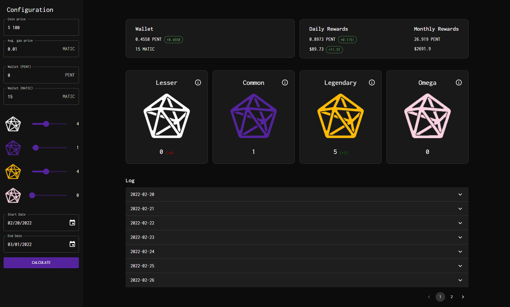

# Pentagon Crypto Playground

<!-- [START badges] -->

[](https://github.com/prettier/prettier)
[](https://app.netlify.com/sites/pentagon-crypto-playground/deploys)

<!-- [END badges] -->

A playground compound calculator for [https://pentagon.financial/](https://pentagon.financial/)

## Preview



## Getting started

Built with:

- React
- Material UI
- Vitejs

### How to use

```sh
yarn install
yarn dev
```

## How to build for production

```sh
yarn build
```

## Contributing

¯\\\_(ツ)\_/¯

## Donating

Feel like buying me a beer? 🍻

> 0xd2d4D33F7539bE8f0f03E748Cb8B1eEB307ce75


